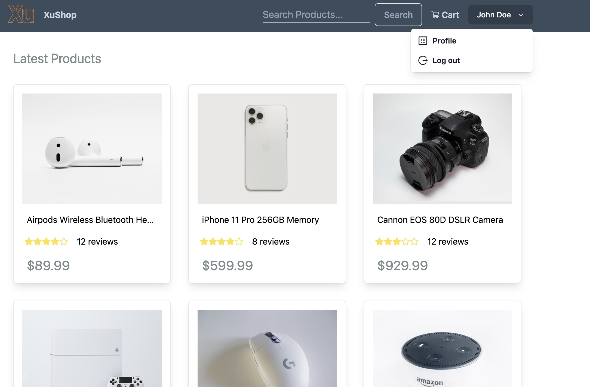
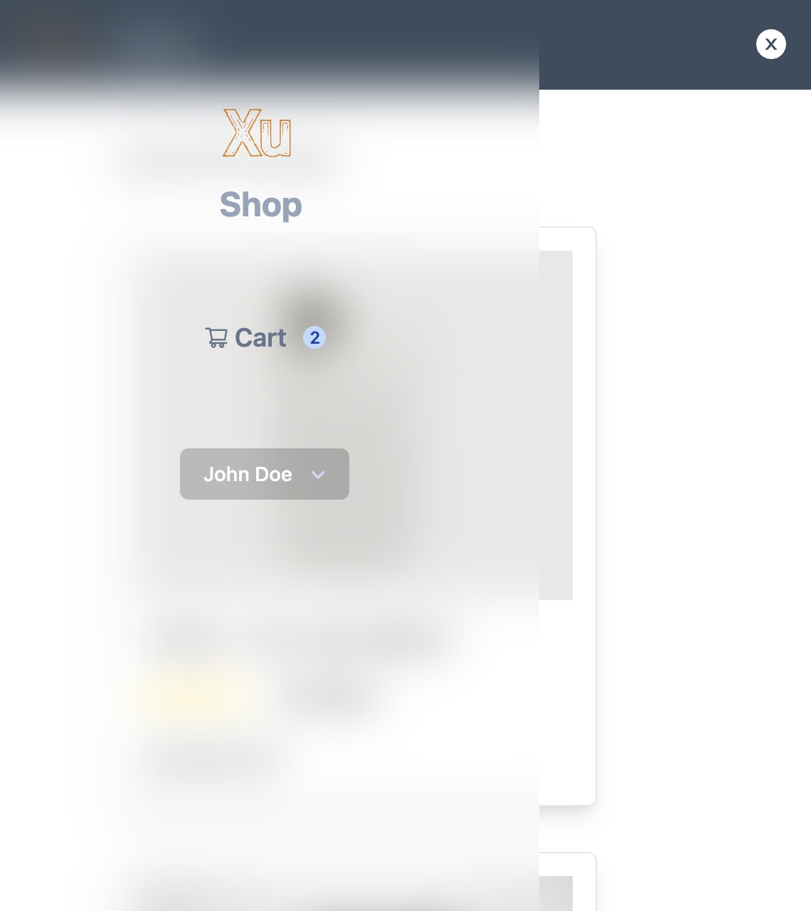
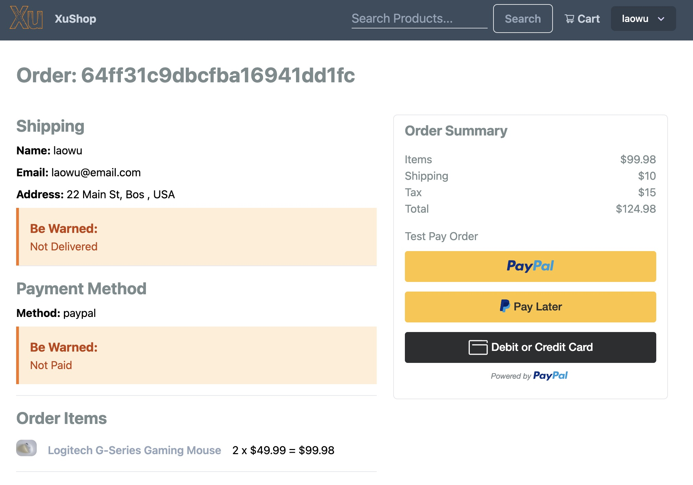

<!-- PROJECT LOGO -->
 

  
<!--  <a href="https://sbodify.netlify.app/">
    <h1 align="center">Spodify</h1>
  </a>-->
  <h3 align="center">
   A modern full-featured eCommerce platform built with the MERN stack & Redux.
  </h3>

   

<!-- ABOUT THE PROJECT -->
## About The Project

**[XuShop]()** is an modern eCommerce platform that allows users to prchase their favorite merchandise. What's more, it even offers admin features that allows admin users to manage customers & orders information,etc.

### Key Features
  - **Full featured shopping cart**: Customers could see their cart items summary, and change the number of the items at any time at their convenience.
  - **Car detail card**: Customers could check out the detailed information about the product they're interested in, such as product name, brand, detailed description, other customers' reviews and ratings, etc.
  - **User profile with orders**: Users could update their profile information and see their order history, etc. 
  - **Checkout process (shipping, payment method, etc)**: Customers could get a prompt about which stage they are currently in .
  - **PayPal / credit card integration**: Customers could choose Payal, debit/credit card 
  - **Admin features (under construction)**: Admin could check and manage orders, users information.
  - **Top products carousel (under construction)**: Customers could see what products are now currently trending in the market.

   &emsp14;&emsp14;&emsp14;&emsp14;
  &emsp14;&emsp14;&emsp14;&emsp14;&emsp14;&emsp14;&emsp14;&emsp14;
  

   &emsp14;&emsp14;&emsp14;&emsp14;
  &emsp14;&emsp14;&emsp14;&emsp14;&emsp14;&emsp14;&emsp14;&emsp14;
  

### Built With

*  React
*  Redux
*  TailwindCSS
*  NodeJs
*  Express
*  MongoDB
