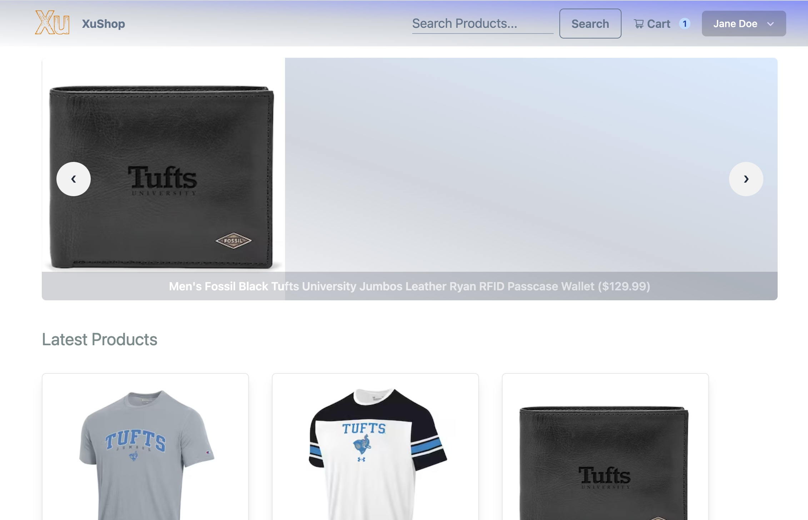
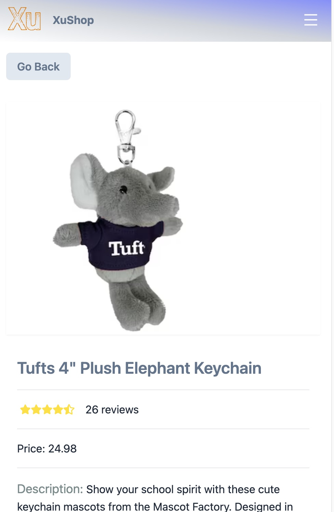
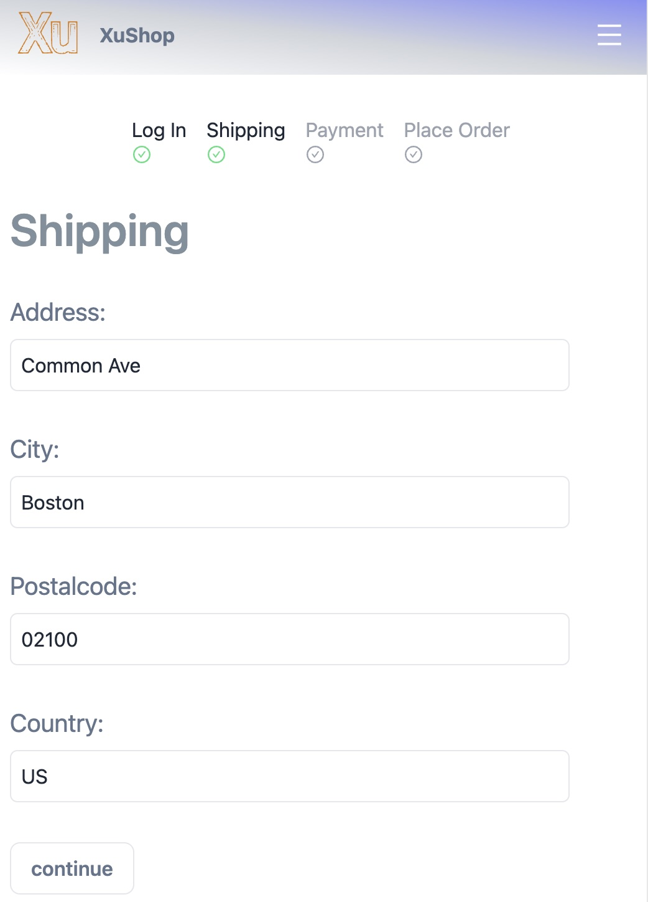

<!-- PROJECT LOGO -->
 

  

  <h3 align="center">
   A modern full-featured eCommerce platform built with the MERN Stack & Redux.
  </h3>

   

<!-- ABOUT THE PROJECT -->
## About The Project

**[XuShop](https://xushop.onrender.com)** is a modern eCommerce platform that allows alumni to prchase their favorite college souvenirs. What's more, it even offers admin features that allows admin users to manage customers & orders information,etc.

### Key Features
  - **Product detail page**: Customers could check out the detailed information about the product they're interested in, such as product name, brand, detailed description, other customers' reviews and ratings, etc.
  - **User profile with orders**: Users could update their profile information and see their order info (e.g. if paid, delivered, etc.).
  - **Checkout process**: Customers could get a prompt about which stage they are currently in (e.g.shipping, payment method, etc) .
  - **PayPal / credit card integration**: Customers could choose Payal, debit/credit card  
  - **Admin features**: Admin could manage orders, modify product listings, and handle user information
  - **Top products carousel**: Customers could see what products are top reviewed by alumni.

   &emsp14;&emsp14;&emsp14;&emsp14;
  &emsp14;&emsp14;&emsp14;&emsp14;&emsp14;&emsp14;&emsp14;&emsp14;
  

   &emsp14;&emsp14;&emsp14;&emsp14;
  &emsp14;&emsp14;&emsp14;&emsp14;&emsp14;&emsp14;&emsp14;&emsp14;
  

       

       

### Built With

*  React
*  Redux
*  RTKQuery
*  TailwindCSS
*  NodeJs
*  Express
*  MongoDB
